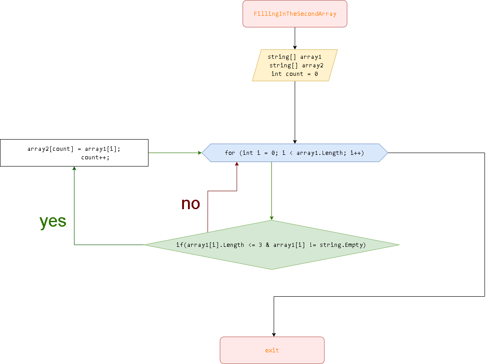

# контрольная работа по основному блоку

## работа по основному блоку 
**Задача:** _Написать программу, которая из имеющегося массива строк формирует  новый массив из строк, длина которых меньше, либо равна 3 символам.Первоначальный массив можно ввести с клавиатуры, либо задать на старте выполнения алгоритма.При решении не рекомендуется пользоваться коллекциями, лучше обойтись исключительно массивами_.

## описания решения
Создается два массива **Mass1** и **Mass2**. один из которых в данном случае **Mass1** заполняется пользователям с клавиатуры методом **filltArray** в котором метод **Prompt** выводит сообщения в консоль, принимает данные от пользователя обробатывает их и возврашает значения в массив **Mass1**.

с помощью метода **FillingInTheSecondArray** заполняется второй массив **Mass2**. _**в цикле метода**_ массив фильтруется с помощью _**проверки условия**_ `array1[i].Length <= 3` на количество символов их не должно быть больше трех; `array1[i] != string.Empty` а также фильтруется на пустые строки.

**в проверке условий** `if` есть переменая **count** которая отвечает за заполнения массива увеличиваясь на **+1**. переменая также не подускает появления **пустот**.

метод **PrintArray** отвечает за распечатку массива в консоле.

## блок схема метода FillingInTheSecondArray
